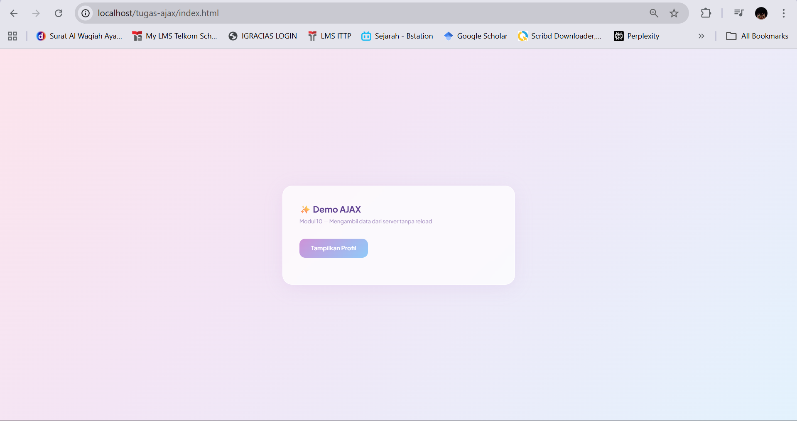

<div align="center">

# LAPORAN PRAKTIKUM
# APLIKASI BERBASIS PLATFORM

---

## MODUL 10
## AJAX (ASYNCHRONOUS JAVASCRIPT AND XML)

---


---

**Disusun Oleh :**

**ANNISA AL JAUHAR**

**2311102014**

**S1 IF-11-REG01**

---

**Dosen Pengampu :**

Dimas Fanny Hebrasianto Permadi, S.ST., M.Kom

---

**PROGRAM STUDI S1 INFORMATIKA**

**FAKULTAS INFORMATIKA**

**UNIVERSITAS TELKOM PURWOKERTO**

**2025/2026**

</div>

---

## 1. Dasar Teori

### AJAX (Asynchronous JavaScript and XML)
AJAX adalah teknik pengembangan web yang memungkinkan halaman web untuk berkomunikasi dengan server dan memperbarui sebagian konten halaman tanpa harus melakukan reload halaman secara penuh. AJAX menggunakan JavaScript untuk mengirim dan menerima data secara asinkron di latar belakang. Pada praktikum ini AJAX digunakan untuk mengambil data profil dari file `data.php` dan menampilkannya ke halaman tanpa reload.

### Fetch API
Fetch API adalah antarmuka modern JavaScript yang digunakan untuk melakukan HTTP request secara asinkron. Fetch API menggantikan XMLHttpRequest dengan sintaks yang lebih bersih dan berbasis Promise. Fetch mengembalikan Promise yang akan resolve dengan objek Response, yang kemudian dapat dikonversi ke berbagai format seperti JSON, teks, atau blob. Pada praktikum ini `fetch()` digunakan untuk mengambil data dari `data.php` dan hasilnya dikonversi menggunakan `.json()` sebelum ditampilkan ke halaman.

### JSON (JavaScript Object Notation)
JSON adalah format pertukaran data ringan yang mudah dibaca oleh manusia maupun mesin. JSON menggunakan pasangan key-value dan mendukung tipe data seperti string, number, array, dan object. Pada praktikum ini PHP menghasilkan data dalam format JSON menggunakan fungsi `json_encode()`, dan JavaScript menerimanya lalu mengakses setiap properti seperti `nama`, `pekerjaan`, dan `lokasi` untuk ditampilkan di halaman.

### PHP sebagai Server-Side Data Provider
PHP digunakan sebagai penyedia data di sisi server. File `data.php` bertugas menyimpan array data profil dan mengirimkannya dalam format JSON menggunakan `echo json_encode()`. Header `Content-Type: application/json` ditambahkan agar browser dan JavaScript mengenali bahwa respons yang diterima adalah data JSON, bukan HTML biasa.

### Event Listener JavaScript
Event Listener adalah mekanisme JavaScript untuk mendeteksi dan merespons interaksi pengguna seperti klik, input, atau scroll. Metode `addEventListener()` digunakan untuk menghubungkan sebuah fungsi dengan event tertentu pada elemen HTML. Pada praktikum ini `addEventListener('click', ...)` digunakan pada tombol "Tampilkan Profil" sehingga ketika tombol diklik, fungsi fetch langsung dijalankan untuk mengambil data dari server.

### DOM Manipulation
DOM (Document Object Model) Manipulation adalah teknik JavaScript untuk mengakses dan mengubah elemen HTML secara dinamis. Dengan memanipulasi DOM, konten halaman dapat diubah tanpa perlu memuat ulang seluruh halaman. Pada praktikum ini `document.getElementById('hasil-profil')` digunakan untuk menargetkan elemen `<div>` kosong, kemudian `innerHTML` dan `appendChild()` digunakan untuk menyisipkan data profil yang diterima dari server ke dalam elemen tersebut.

### Bootstrap 5
Bootstrap 5 adalah framework CSS open-source yang menyediakan komponen antarmuka yang responsif dan modern. Bootstrap memiliki grid system, komponen kartu, badge, tombol, dan berbagai utilitas CSS yang memudahkan pembuatan tampilan web. Pada praktikum ini Bootstrap 5 digunakan untuk membangun tampilan halaman AJAX dengan desain pastel yang menarik, termasuk card utama, tombol bergradien, serta kartu profil yang muncul dengan animasi saat data berhasil diambil dari server.

---

## 2. Struktur Project

```
Tugas-Modul-10---Ajax/
├── data.php       (server: menyediakan data JSON)
└── index.html     (client: tampilan + logika AJAX)
```

---

## 3. Source Code

### data.php
```php
<?php
header('Content-Type: application/json');

$profil = [
    ['nama' => 'Budi',  'pekerjaan' => 'Web Developer', 'lokasi' => 'Jakarta'],
    ['nama' => 'Sari',  'pekerjaan' => 'UI Designer',   'lokasi' => 'Bandung'],
    ['nama' => 'Andi',  'pekerjaan' => 'Data Analyst',  'lokasi' => 'Surabaya'],
];

echo json_encode($profil);
?>
```

### index.html
```html
<!DOCTYPE html>
<html lang="id">
<head>
  <meta charset="UTF-8" />
  <meta name="viewport" content="width=device-width, initial-scale=1.0"/>
  <title>Modul 10 - AJAX</title>
  <link href="https://cdn.jsdelivr.net/npm/bootstrap@5.3.3/dist/css/bootstrap.min.css" rel="stylesheet"/>
  <link href="https://fonts.googleapis.com/css2?family=Plus+Jakarta+Sans:wght@400;500;600;700&display=swap" rel="stylesheet"/>
  <style>
    body {
      font-family: 'Plus Jakarta Sans', sans-serif;
      min-height: 100vh;
      background: linear-gradient(135deg, #fce4ec 0%, #f3e5f5 40%, #e3f2fd 100%);
      display: flex;
      align-items: center;
      justify-content: center;
      padding: 2rem;
    }

    .card-main {
      background: rgba(255,255,255,0.75);
      backdrop-filter: blur(16px);
      border: 1px solid rgba(255,255,255,0.9);
      border-radius: 24px;
      padding: 2.5rem;
      max-width: 560px;
      width: 100%;
      box-shadow: 0 8px 40px rgba(180,140,210,0.15);
    }

    .page-title {
      font-size: 1.3rem;
      font-weight: 700;
      color: #5c3d8f;
      margin-bottom: 4px;
    }

    .page-sub {
      font-size: 0.82rem;
      color: #a08abf;
      margin-bottom: 2rem;
    }

    .btn-fetch {
      background: linear-gradient(135deg, #ce93d8, #90caf9);
      border: none;
      border-radius: 14px;
      color: #fff;
      font-weight: 600;
      font-size: 0.9rem;
      padding: 12px 28px;
      cursor: pointer;
      transition: opacity 0.2s, transform 0.15s;
    }

    .btn-fetch:hover {
      opacity: 0.88;
      transform: translateY(-2px);
    }

    #hasil-profil {
      margin-top: 1.5rem;
      display: flex;
      flex-direction: column;
      gap: 12px;
    }

    .profil-card {
      background: rgba(255,255,255,0.8);
      border: 1px solid rgba(200,180,230,0.35);
      border-radius: 16px;
      padding: 14px 18px;
      display: flex;
      align-items: center;
      gap: 14px;
      animation: fadeUp 0.3s ease forwards;
      opacity: 0;
    }

    @keyframes fadeUp {
      from { opacity: 0; transform: translateY(8px); }
      to   { opacity: 1; transform: translateY(0); }
    }

    .profil-avatar {
      width: 42px; height: 42px;
      border-radius: 50%;
      font-weight: 700;
      font-size: 0.85rem;
      display: flex; align-items: center; justify-content: center;
      flex-shrink: 0;
    }

    .av-1 { background: #f8bbd0; color: #ad1457; }
    .av-2 { background: #b2ebf2; color: #00838f; }
    .av-3 { background: #d1c4e9; color: #512da8; }

    .profil-info { font-size: 0.875rem; color: #4a3a6a; }
    .profil-info strong { font-weight: 700; display: block; margin-bottom: 2px; }
    .profil-info span  { color: #9e8abf; font-size: 0.8rem; }
  </style>
</head>
<body>

  <div class="card-main">
    <div class="page-title">✨ Demo AJAX</div>
    <div class="page-sub">Modul 10 — Mengambil data dari server tanpa reload</div>

    <button class="btn-fetch" id="btnTampilkan">
      Tampilkan Profil
    </button>

    <div id="hasil-profil"></div>
  </div>

  <script src="https://cdn.jsdelivr.net/npm/bootstrap@5.3.3/dist/js/bootstrap.bundle.min.js"></script>
  <script>
    const avatarClass = ['av-1', 'av-2', 'av-3'];

    document.getElementById('btnTampilkan').addEventListener('click', function () {
      const container = document.getElementById('hasil-profil');
      container.innerHTML = '<p style="color:#a08abf;font-size:0.85rem;margin:0">Mengambil data...</p>';

      fetch('data.php')
        .then(function (res) { return res.json(); })
        .then(function (data) {
          container.innerHTML = '';

          data.forEach(function (orang, i) {
            const initials = orang.nama.split(' ').map(function(w){ return w[0]; }).join('').toUpperCase();
            const card = document.createElement('div');
            card.className = 'profil-card';
            card.style.animationDelay = (i * 0.1) + 's';
            card.innerHTML =
              '<div class="profil-avatar ' + avatarClass[i % 3] + '">' + initials + '</div>' +
              '<div class="profil-info">' +
                '<strong>' + orang.nama + '</strong>' +
                '<span>' + orang.pekerjaan + ' &nbsp;·&nbsp; 📍 ' + orang.lokasi + '</span>' +
              '</div>';
            container.appendChild(card);
          });
        })
        .catch(function () {
          container.innerHTML = '<p style="color:#e57373;font-size:0.85rem;margin:0">⚠️ Gagal mengambil data. Pastikan data.php sudah ada dan XAMPP menyala.</p>';
        });
    });
  </script>

</body>
</html>
```

---

## 4. Langkah-Langkah Penggunaan

### 4.1 Tampilan Awal Halaman
Saat aplikasi dibuka di browser melalui XAMPP pada alamat `http://localhost/tugas-ajax/index.html`, akan tampil halaman Demo AJAX dengan latar belakang gradien pastel pink-ungu-biru. Di tengah halaman terdapat card utama berwarna putih transparan dengan judul **✨ Demo AJAX** dan subjudul *Modul 10 — Mengambil data dari server tanpa reload*. Terdapat satu tombol berlabel **Tampilkan Profil** dengan warna gradien ungu-biru. Pada tahap ini `div#hasil-profil` masih kosong dan belum ada data yang ditampilkan.



### 4.2 Tampilan Setelah Tombol Diklik
Ketika tombol **Tampilkan Profil** diklik, JavaScript menjalankan `fetch('data.php')` untuk mengambil data dari server secara asinkron. Setelah data berhasil diterima dalam format JSON, tiga kartu profil muncul satu per satu dengan animasi fade-up di dalam `div#hasil-profil`. Setiap kartu menampilkan avatar inisial nama berwarna pastel, nama lengkap, pekerjaan, dan lokasi. Proses ini berlangsung tanpa reload halaman sama sekali, yang merupakan inti dari konsep AJAX.


---

## 5. Cara Menjalankan Aplikasi
```bash
# 1. Pastikan XAMPP sudah terinstal dan Apache sudah aktif

# 2. Salin folder project ke direktori htdocs XAMPP
#    Contoh: C:\xampp\htdocs\Tugas-Modul-10---Ajax\

# 3. Buka browser dan akses aplikasi
http://localhost/tugas-ajax/index.html
```